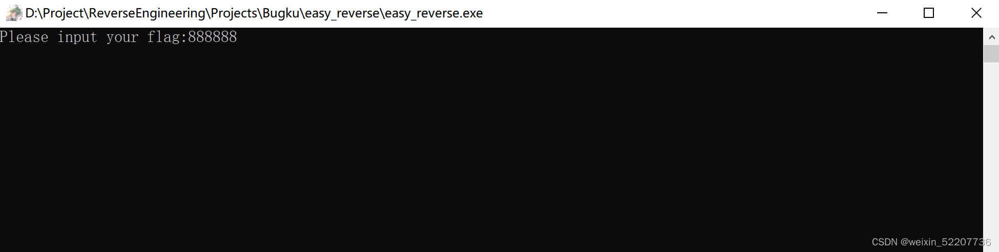
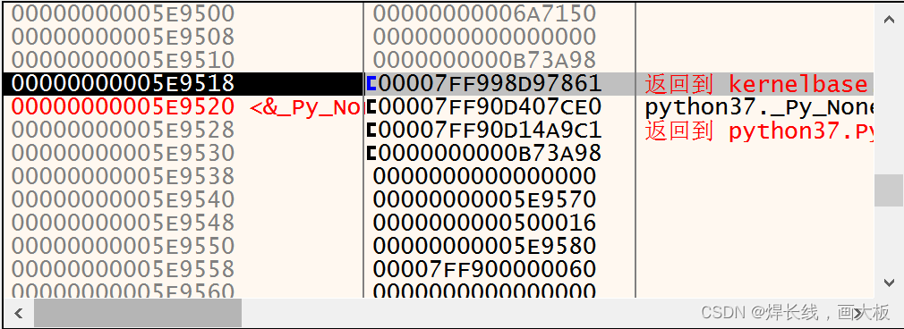
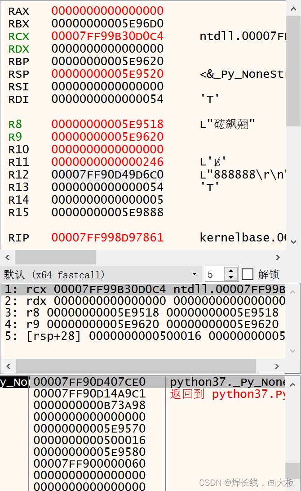
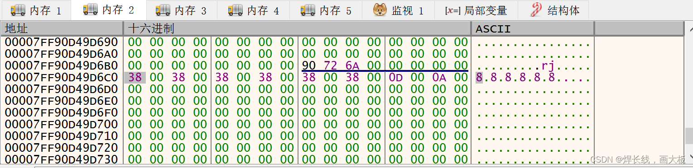
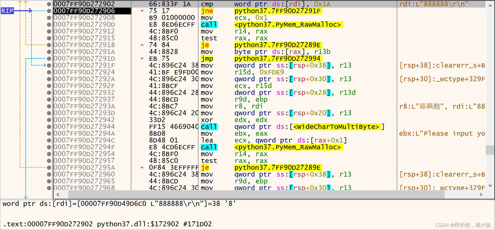
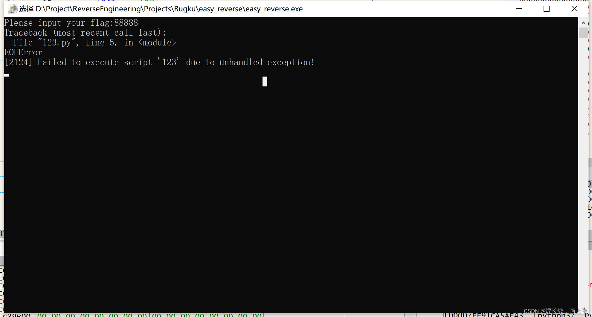
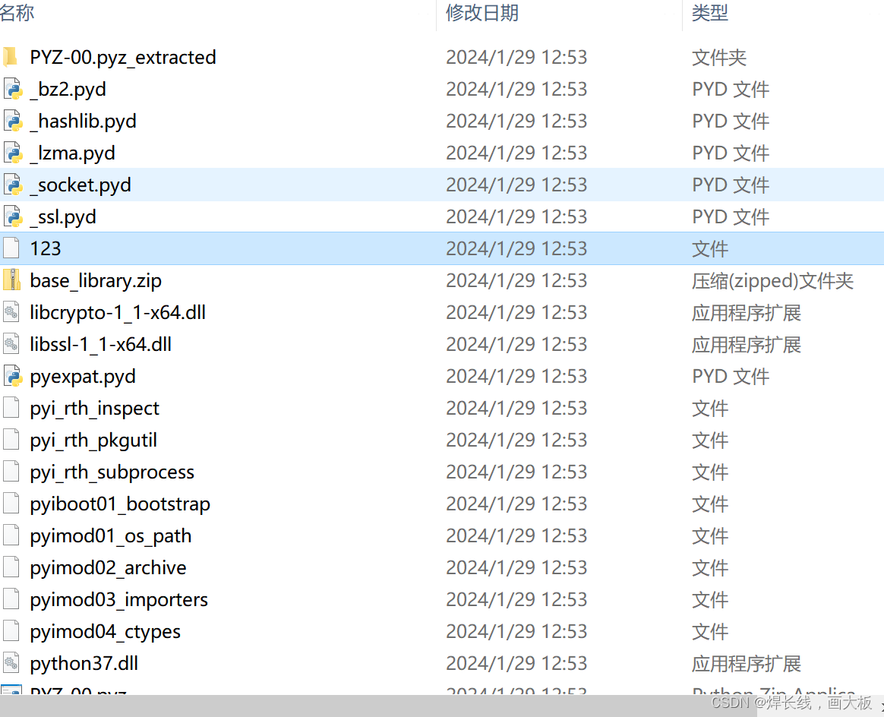
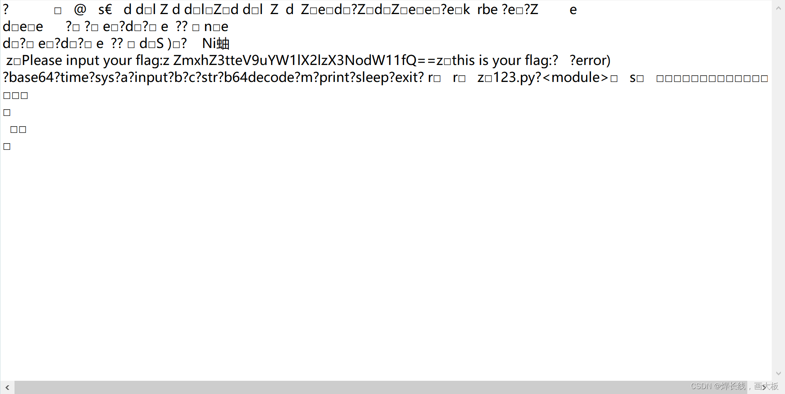
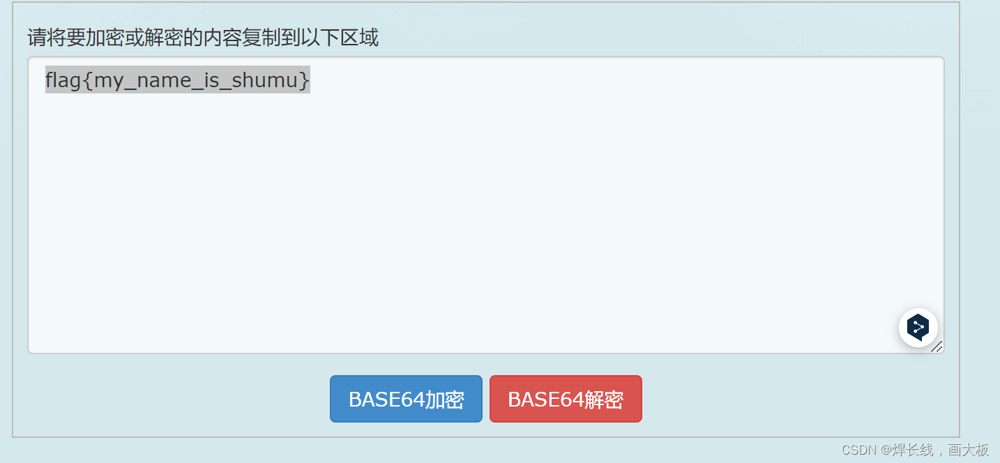

## 第一次跟踪

首先用 OD 打开运行程序，快速定位到输入位置并且在其后打断点，接着输入。

回车后暂停程序以找到处理数据位置，但是跟踪下去并没有线索。

重新跟踪下发现程序生成了一个新线程来处理输入数据：

## 附加新线程

于是再开一个 OD attach 该线程，查看栈空间：

在这些返回点各下一个断点，然后在输入窗口输入并回车。

发现程序断点触发，并且此时寄存器数据如下：

出现了输入的字符串，跳转到到对应的内存空间。

接下来的思路很明确了：对该地址下读断点，每当该地址被读取就会触发，再从对应位置开始分析代码即可。

跟踪发现以下代码：

这里是对输入 EOF 进行检查，如果把 jne 改为 nop，就会触发错误：

## 解包程序

到这里已经很明显了，这是一个 PyInstaller 打包的 Python 程序。我当时尝试到这里时没管这个信息，选择不改 jne 正常跟踪下去，然后是一段很长很长的跟踪...没有结果。

最后还是用 PyInstaller 解包，得到如下文件：

打开之前出现过的 123 文件，里面是一段 base64 编码：

在线解密得到：

结束。

做逆向方向还是挺重要的，之前没意识到是 PyInstaller 打包程序，浪费了很多时间...

