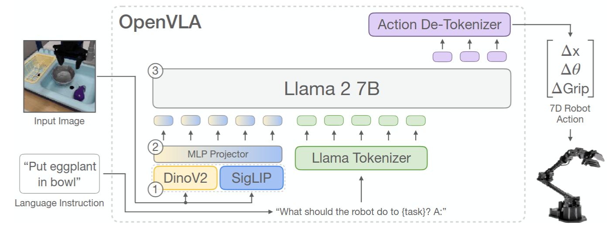
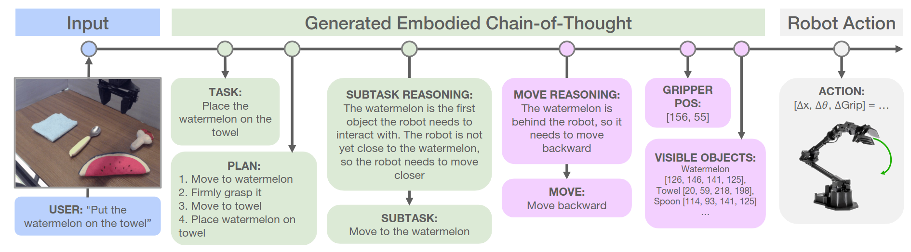

> 我们对VLA通常期望强大的语言遵循能力以及其带来的泛化能力，然而在实际实验里，L的表现并不理想， VLA真正能理解语言吗，还是只把L当作长一点的id。 
> 现在的VLA似乎更像是VA，L被V淹没，实际上只是一个参数量更大一点的模仿学习罢了。 
> 遵循这个疑问，我阅读了一些相关论文，在此列出。

## ECoT
[paper](https://arxiv.org/abs/2407.08693)

### Question
1. 基于模仿学习的机器人模型难以在训练数据外泛化
2. 是否能将CoT引入机器人模型来提升性能?

### Motivation
1. 大模型CoT在机器人上的直接迁移效果并不好
2. CoT在推理时缺乏对低层控制的观察与理解

### Data
1. 基于BridgeV2，对其中的数据手动标注，用PrimisticVLM进行场景理解与分析
2. 用DINO对目标设定图像框
3. OWLv2和SAM依据机器人状态和夹爪位置计算运动原语
4. 最后用Gemini1.0总结并设定推理链，拼接成长文本输入

### Arch
Backbone: OpenVLA-7B 
Loss&Reward: 自回归交叉熵损失

### Experiments

### Conclusion