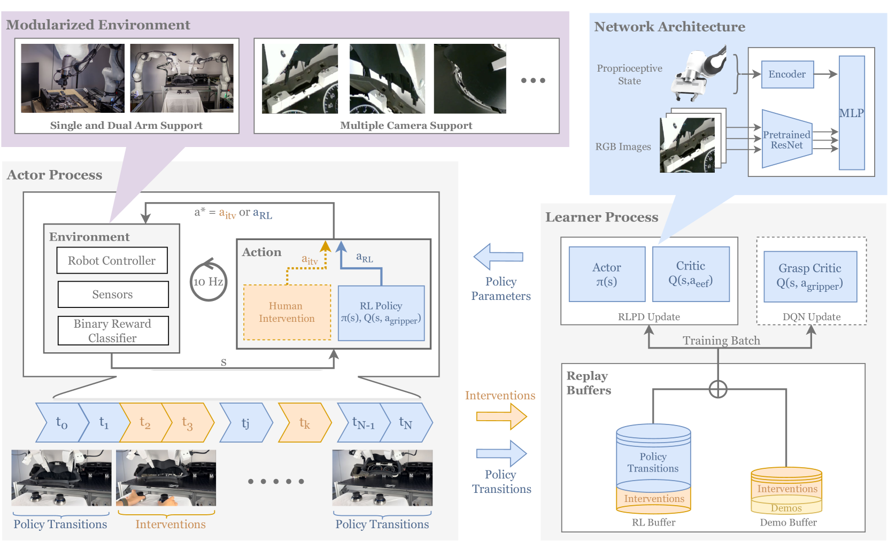

> Does reinforcement learning really incentivize action capacity in vlas beyond the base model?

## HIL-SERL
[paper](https://arxiv.org/abs/2410.21845v3)

### Motivation
1. 如何在真实世界中直接学习复杂的操作技能
2. IL存在累计误差问题
3. RL从头训练太不稳定(奖励难以设定,探索困难)

### Method
1. 通过人类干预收集on-policy数据，从离线和在线数据中等概率采样学习
2. 训练一个图像分类器以实现稀疏奖励

### Arch
Backbone: ResNet-10  
Components: RLPD + Actor & Critic(MLP) + Grasp Critic(DQN)  
Reward: Sparse

### Experiments
实现了一个主板组装任务, 包含内存插入、SSD组装、USB插入、电缆夹紧。分别训练上述四个子任务，将它们串联起来完成整个任务。

### Conclusion
强化学习确实能够在实际环境中通过实用训练时间解决基于视觉的复杂操作任务。关键在于系统级整合人类纠正、高效的离线策略算法（RLPD）以及适当的控制接口。

## PLD
[paper](https://arxiv.org/abs/2511.00091v1)

### Motivation
1. 如何让大型 VLA 模型在不依赖昂贵的人类演示数据的情况下实现自我提升  
2. SFT依靠人类演示且存在累计误差  
3. RL从头训练困难且不稳定  

### Method
提出三阶段训练框架
1. 冻结策略主干，训练轻量级残差策略网络输出动作偏移量与模型输出相加  
2. 让基础策略运行一定步数(到次优或失败状态)，再让残差策略接管以收集数据  
3. 加入step2收集的数据进行SFT  
### Arch
Backbone: PI0  
Components:  
- Actor:3层MLP
- Critic: CDQ(ResNetV1-10+Cal-Q初始化)
Loss&Reward: Flow matching + Sparse
### Experiments
Benchmarks: Libero-90 + SimplerEnv  
Realworld: 基于Franka机械臂，连续一小时进行GPU插入任务  
Ablation: 
- RL Baselines: RLPD, WSRL, JSRL, Cal-QL, IQL
- Design:  
Reward shaping: 可以增加收敛速度,但较大的偏差会显著阻碍性能。最终并未使用  
Action scale: 增量动作通常会被缩小并限制在 [−ξ,ξ] 范围内,过大探索不稳定，过小探索不足且渐进性能低  
Critic pre-training: 仅考虑50条基础数据，Cal-QL表现最好，CQL最差  
Update frequency: 学习者在与数据收集者同步参数之间执行的梯度步数，扫描1-500，并不敏感  
On-the-Fly Policy: 较大的采样大小(>20)显示出显著的性能提升。但经验上，渐近性能最终会变得相似.设置OTF=1  
JSRL: 总体高效，但部分任务无法收敛，鲁棒性不如PLD

### Conclusion
通过RL生成的策略对齐数据，使VLA能够在没有人类额外干预的情况下自我进化

## Next

### Question

### Motivation

### Method

### Arch

### Experiments

### Conclusion