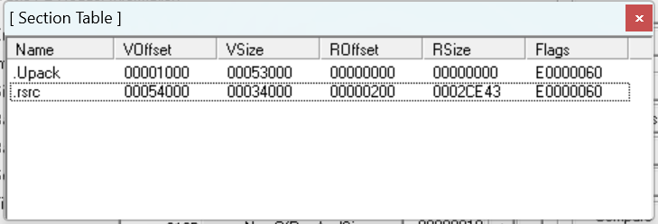
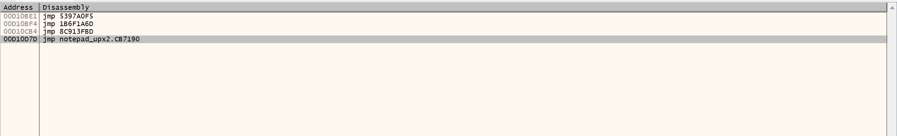
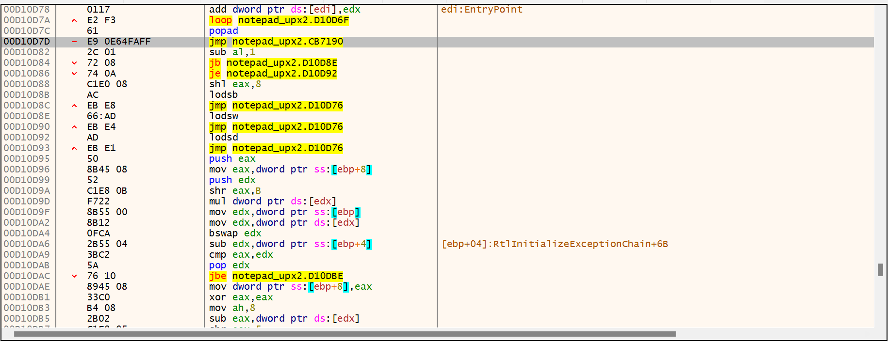
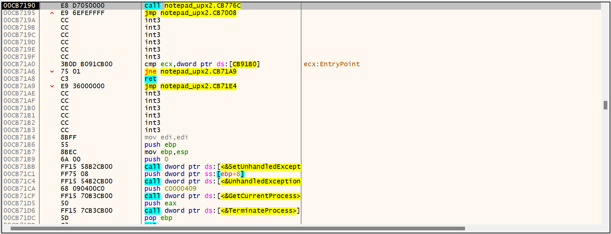
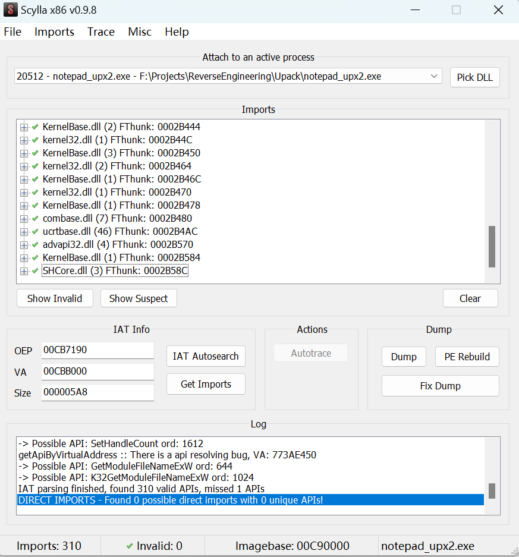

## 预处理

首先，在 `C:\Windows\SysWOW64` 目录下可以找到记事本的 32 位版本 `notepad.exe`，用 winpack 对他加壳得到 `notepad_upx1.exe`。

先用 LordPE 分析目标程序的 PE 头，

可以看到加壳后文件被分为两个区，`.Upack` 里是空的，这是因为 Upack 把原本分区数据压缩后放入 `.rsrc` 区中，运行时解压缩后才会把数据放回 `.Upack` 区里，脱壳就是找到程序的 OEP。

用 x32dbg 打开 `notepad_upx1.exe`，

可以看到程序的 EP 是 `00D10B67`，在第二节区。由于 OD 把数据也识别成代码的关系，往上一翻会发现 pushad 消失了，但是不影响代码执行。这里用两种方法找到 OEP。

## 寻找OEP

### 根据跨段指令寻找

因为最后代码会被解压缩到第一个节区，所以必然有一个大的 jmp 或者 call eax。Ctrl+B 输入 `E9` 查找 jmp 指令，

最后后一个 jmp 到 `00CB7190` 位于 `.Upack` 区，直接锁定，

F4 到对应位置跳转过去，

接下来调用 x32dbg 自带的 Scylla 修复，把 `00CB7190` 设为 OEP 自动寻找 IAT 并导入（出错的导入模块可以先直接删除，之后再看能不能运行）。

dump 并 fix dump 分别得到 `filename_dump.exe` 和 `filename_dump_SCY.exe` 文件，后者就是我们要的脱壳程序，运行成功。

### 根据堆栈平衡原理寻找

在程序去到 OEP 的前一刻大概率要恢复寄存器环境，可以对程序在 EP 的 ESP 所存地址下硬件断点，多 F9 几次即可找到 OEP。